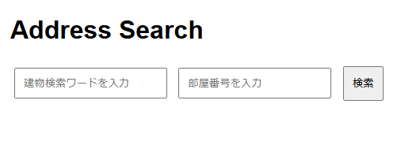

# Fibre From Address

This project is a Flask application to search for fiber type from an address.

By entering a search word related to the property and the room number, it uses Selenium to determine the fiber type of that address from the FLET'S Hikari service area search site.

[Japanese Version](README_jp.md)

## Required Environment

- Python 3.10
- Docker
- Docker Compose
- (Optional) Kubernetes

## Setup (docker)

### 1. Start Selenium with Docker Compose

```sh
$ docker-compose up -d
```

## 2. Setup (Kubernetes)

```sh
$ kubectl apply -f deploy.yaml
$ kubectl apply -f service.yaml
$ kubectl apply -f ingress.yaml
```

## Usage

### 2. Endpoints

- `POST /api/search?address=<search word>&roomNumber=<room number>`: Search for fiber type by specifying the address and room number.

### 3. Frontend

Access `http://localhost:5000` in your browser, enter the address and room number, and search.



## Development

### 1. Run Docker Container

```sh
make docker-run
```

## License

This project is released under the MIT License.